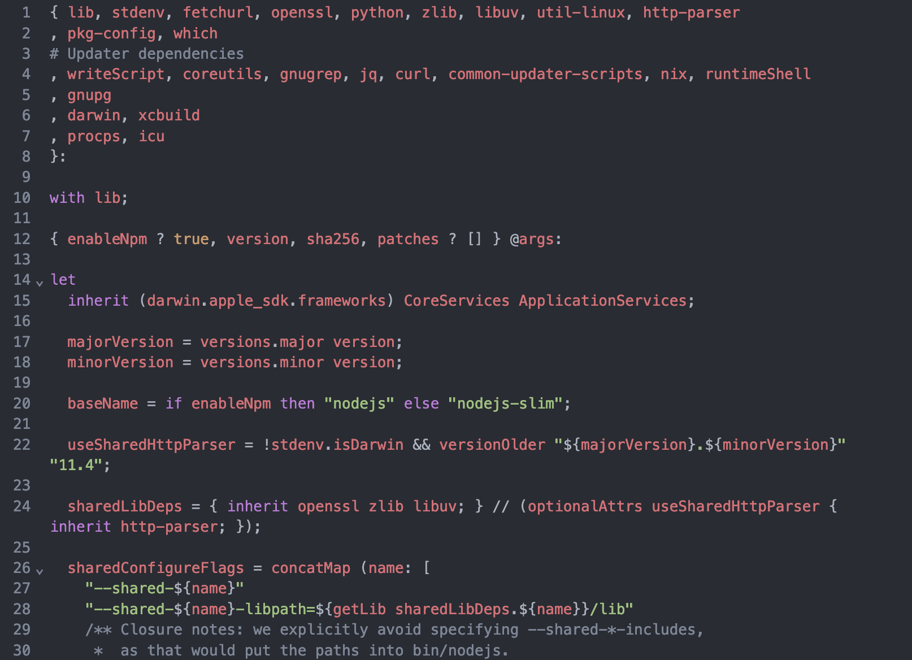

# CodeMirror Nix Mode

[](https://replit.com/@util/codemirror-lang-nix)
<span class="badge-npmversion"><a href="https://npmjs.org/package/@replit/codemirror-lang-nix" title="View this project on NPM"></a></span>

A codemirror extension that adds Nix syntax highlighting and language features.



### Usage

```typescript
import { EditorState } from '@codemirror/state';
import { EditorView } from '@codemirror/view';
import { nix } from "@replit/codemirror-lang-nix";
import { basicSetup } from 'codemirror';

new EditorView({
  state: EditorState.create({
    doc: `{ pkgs ? import <nixpkgs> {} }: pkgs.mkShell { buildInputs = [ pkgs.nodejs ]; }`,
    extensions: [basicSetup, nix()],
  }),
  parent: document.querySelector('#editor'),
});
```
