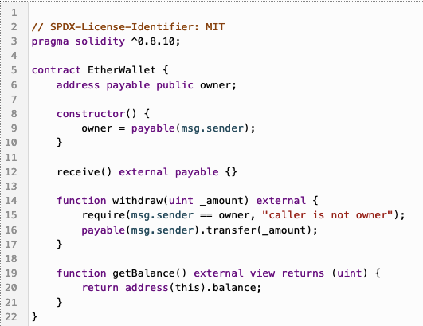

# CodeMirror Solidity Language Support

<span><a href="https://replit.com/@util/codemirror-lang-solidity" title="Run on Replit badge"></a></span>
<span><a href="https://www.npmjs.com/package/@replit/codemirror-lang-solidity" title="NPM version badge"></a></span>

A CodeMirror extension that provides Solidity syntax highlighting and language support.



### Usage

```ts
import { basicSetup } from 'codemirror';
import { EditorView } from '@codemirror/view';
import { EditorState } from '@codemirror/state';
import { solidity } from '@replit/codemirror-lang-solidity';

const doc = `
pragma solidity ^0.8.10;

contract EtherWallet {
    address payable public owner;

    constructor() {
        owner = payable(msg.sender);
    }

    receive() external payable {}

    function withdraw(uint _amount) external {
        require(msg.sender == owner, "caller is not owner");
        payable(msg.sender).transfer(_amount);
    }

    function getBalance() external view returns (uint) {
        return address(this).balance;
    }
}
`

new EditorView({
  state: EditorState.create({
    doc,
    extensions: [
      basicSetup,
      solidity,
    ],
  }),
  parent: document.querySelector('#editor'),
});
```